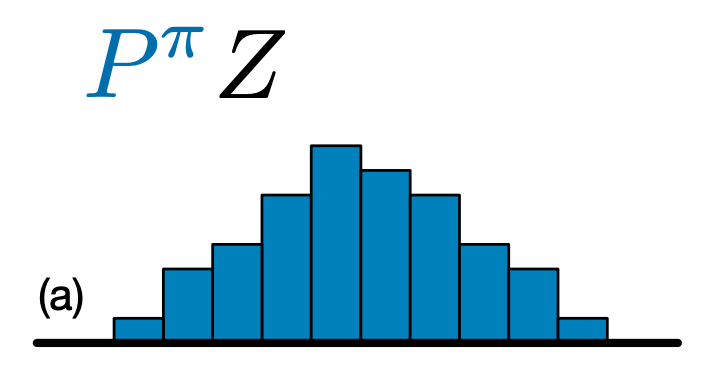

# OpenAI Gym

#### For this project, Everything is well labelled with images in the Notebook, I started by understanding the OpenAI Gym's environment variables

#### Tensorflow environments are built in compatibility with python environment which have support for the OpenAI Gym, DeepMind and Atari.

#### Policies in RL are defined to map environmental observations to actions, 
#### for instance, DQNs are based on Bellman's equation

#### Tensorflow Drivers are used to execute the policies in RL

#### Replay Buffers are used to store trajectories of experience when executing a policy in an environment.

## Building a network and training agent

#### having all the basics I proceeded step by step as given in Tensorflow docs (resource 2) but while importing reverb, which was required for data collection for the buffer

    # import reverb

#### I ran into compatibility issues, even using GoogleColab didn't solve the issue

#### Next, I tried creating a DQN class in python,But DQN class even with 3 layer network took much longer time to train (resource 4), So I had to look for other agents

#### While reading the documentation I noticed that DQN C51 doesn't use reverb library of Python for creating data collection or replay buffer. So I decided to use that agent (resource 5)

#### DQN C51 predicts a histogram model for probability distribution. By learning the distribution rather than simply the expected value, the algorithm is able to stay more stable during training, leading to improved final performance. 

## Resources
   (1) https://towardsdatascience.com/deep-q-learning-tutorial-mindqn-2a4c855abffc
    
   (2) https://www.tensorflow.org/agents/tutorials/0_intro_rl
   
   (3) https://www.tensorflow.org/agents/tutorials/1_dqn_tutorial#agent
   
   (4) https://medium.com/@gsurma/cartpole-introduction-to-reinforcement-learning-ed0eb5b58288
    
   (5) https://www.tensorflow.org/agents/tutorials/9_c51_tutorial#agent